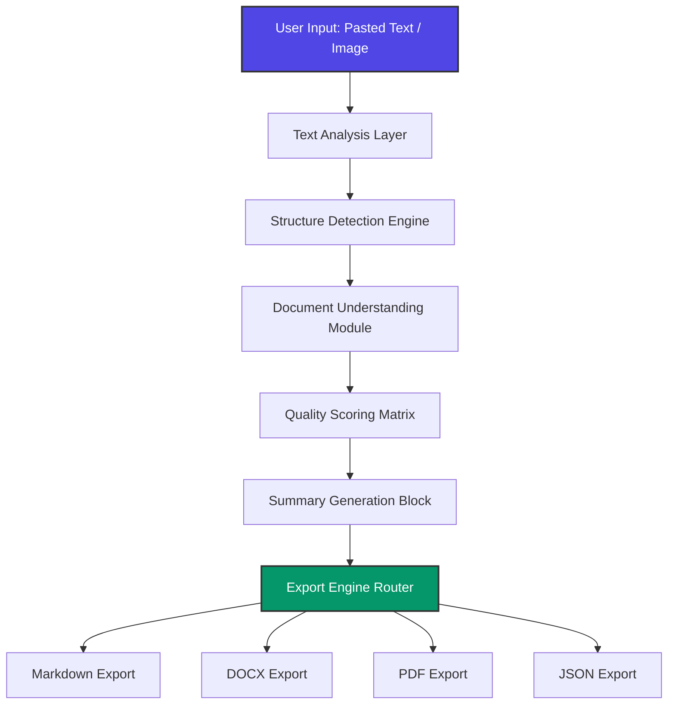

# 📄 Structify AI

<p align="center">
  
  
  
  
  
  
</p>

<p align="center">
  <strong>Turn messy OCR text into structured documents.</strong>
</p>

<p align="center">
  <a href="https://structify-ai-beta.vercel.app">🌐 Live Frontend Demo</a> •
  <a href="https://structify-ai-backend.onrender.com/docs">🔌 Live API Documentation</a> •
  <a href="#-key-features">Key Features</a> •
  <a href="#%EF%B8%8F-architecture">Architecture</a> •
  <a href="#-installation--setup">Installation</a>
</p>

---

## 📌 Project Overview

**Structify AI** is an AI-powered document structuring and formatting platform designed to transform chaotic, unformatted text into clean, structured, and exportable digital assets.

### 🛑 The Problem
Many scanned documents, copied text blocks, raw OCR outputs, PDFs, unorganized notes, and extracted texts lose their original structural context during conversion. Common issues include:
* Headings flattened into normal body text.
* Messy, broken paragraph flows.
* Lists losing their indentation and bullet formatting.
* Total loss of overall document structural hierarchy.
* Fragmented sentences introduced by legacy OCR engines.

As a result, users frequently spend excessive time manually rewriting and reorganizing documents back into a usable structure.

### 💡 The Solution
Structify AI automates layout recovery. By analyzing raw text inputs, the platform dynamically identifies structural hierarchies, runs deep analytical understanding, benchmarks data quality, summarizes core content, and exports ready-to-use documents in universal standard file formats.

---

## ✨ Key Features

* **🔤 Raw Text Analysis:** Users can directly paste raw text streams into the application for immediate processing and semantic breakdown.
* **📂 Document Structure Detection:** Automatically identifies structural components including:
  * Titles
  * Headings
  * Subheadings
  * Paragraphs
  * List Items
* **🧠 AI-Style Document Understanding:** Driven by specialized internal engines:
  * **Structure Engine:** Maps abstract hierarchy levels.
  * **Document Analyzer:** Classifies structural trends.
  * **Quality Scoring:** Measures text formatting data health.
  * **Summary Generation:** Produces clean context summaries out of massive inputs.
* **💾 Multi-Format Export Engine:** High-fidelity conversion to downstream formats:
  * Markdown (`.md`)
  * Microsoft Word (`.docx`)
  * Adobe PDF (`.pdf`)
  * Structured Data (`.json`)
* **🎨 Modern Frontend Interface:** Designed with a production-grade dark theme, intuitive drag-and-drop or paste input fields, and quick-action layout displays.
* **🔌 Standardized FastAPI Architecture:** Complete programmatic accessibility backed by self-documenting endpoints.

---

## 🛠️ Tech Stack

| Component | Technology | Description |
| :--- | :--- | :--- |
| **Frontend** | `Next.js` | React framework for web production |
| **Frontend** | `React` | Component UI development layer |
| **Frontend** | `TypeScript` | Static type safety configuration |
| **Frontend** | `Tailwind CSS` | Utility-first styling architecture |
| **Backend** | `FastAPI` | High-performance Python web API architecture |
| **Backend** | `Python` | Primary ecosystem computational language |
| **AI / NLP** | `EasyOCR` | Deep-learning optical character recognition wrapper |
| **AI / NLP** | `spaCy` | Advanced industrial natural language processing |
| **AI / NLP** | `SpellChecker` | Pure Python token mutation and spelling repair |
| **Export Engines** | `python-docx` | Native Microsoft Word binary conversion suite |
| **Export Engines** | `FPDF2` | Minimal programmatic PDF document generation |
| **Deployment** | `Vercel` | Managed hosting environment for the frontend client |
| **Deployment** | `Render` | Managed cloud application platform hosting the backend service |

---

## 🏗️ Architecture

The flow chart below illustrates how unstructured data flows through the application layers to produce cleanly structured output files.



---

## 📂 Project Structure

```text
Structify-AI/
├── backend/
│   ├── config/         # System environmental & server variable bindings
│   ├── routes/         # API endpoint routers and access pathways
│   ├── schemas/        # Pydantic data schemas & request/response validation mapping
│   └── services/       # Text processing engines, NLP pipelines, & export handlers
└── frontend/
    ├── app/            # Next.js Application router layout and page components
    ├── components/     # Reusable client interface UI modules
    └── styling/        # Tailwind configuration, styles, and custom themes

```

---

## 🔌 API Endpoints Overview

The backend service hosts comprehensive self-documenting files using Swagger UI. You can access the interactive explorer live via the `/docs` path on the running host.

### Core Signature Routings

#### `GET /`

Returns the root service deployment welcome index metadata packet.

#### `GET /docs`

Serves the auto-generated OpenAPI/Swagger UI system interactive validation dashboard.

#### `POST /api/v1/text/analyze`

Accepts raw unstructured string blobs to extract deep metadata mappings, document quality matrices, and semantic summarizations.

#### `POST /api/v1/export`

Compiles organized data representations directly into downloadable binaries based on format selections (Markdown, DOCX, PDF, or JSON).

---

## ⚙️ Installation & Setup

Ensure you have Python 3.10+ and Node.js 18.x+ installed on your local workstation environment before building.

### 🐍 Backend Deployment

1. Navigate to the backend directory:
```bash
cd backend

```


2. Create an isolated environment instance:
```bash
python -m venv venv
source venv/bin/activate  # On Windows run: venv\Scripts\activate

```


3. Install required software bundles:
```bash
pip install -r requirements.txt

```


4. Fire up the local Uvicorn gateway:
```bash
uvicorn main:app --reload

```


### ⚛️ Frontend Deployment

1. Shift directory contexts into the frontend path:
```bash
cd ../frontend

```


2. Restore package asset trees:
```bash
npm install

```


3. Run the client system under local development mode:
```bash
npm run dev

```


---

## ⚠️ Current Limitations

* **Cloud OCR Model Memory Failures:** The OCR image extraction layer utilizes `EasyOCR`, which demands substantial runtime memory footprint footprints during model initializations.
* **Render Free Tier Limits:** Due to strict hardware allocation boundaries enforced on the free deployment tier of Render, cloud-hosted OCR executions run into structural memory threshold faults, resulting in loading failures.
* **Current Status:** The OCR execution stack works flawlessly under standard **local system development deployments**. Cloud-hosted workflows are constrained until infra scaling upgrades occur.

---

## 📊 Current Project Status

The minimum viable product (MVP) phase is fully resolved and operational across production instances.

* ✅ **Text Analysis Engine** — Working smoothly
* ✅ **Structure Detection Module** — Working smoothly
* ✅ **Summary Generation Services** — Working smoothly
* ✅ **Quality Scoring Metrics** — Working smoothly
* ✅ **Markdown Document Export** — Working smoothly
* ✅ **DOCX Document Export** — Working smoothly
* ✅ **PDF Document Export** — Working smoothly
* ✅ **JSON Schema Data Export** — Working smoothly
* ✅ **Vercel Client Frontend Deployment** — Working smoothly
* ✅ **Render Host Backend Deployment** — Working smoothly
* ⚠ **OCR Engine Processing** — Partially Functional (*Local processing works; cloud deployment optimization is pending infrastructure memory scale improvements.*)

---

## 📸 Platform Previews

### Home Interface

*Minimalist interface designed for text input and feature routing.*


### Text Analysis & Structuring Workspace

*Live textual structural engine sorting headings, sub-headings, and paragraph layout formats.*


### Quality Analytics & Export System

*Real-time generation dashboard displaying quality metric grading alongside download format selectors.*


---

## 🗺️ Future Roadmap

### 🚀 Version 2 (Infrastructure Optimization & Core Extensions)

* Implement advanced cloud OCR deployment enhancements to circumvent infrastructure constraints.
* Integrate multi-language OCR recognition profiles.
* Enhance internal document type classification heuristics.

### 📄 Version 3 (Targeted Functional Context Profiles)

* **Resume Mode:** Tailored logic matrices for cleaning and parsing CV patterns.
* **Academic Paper Mode:** Specialized processing to accurately handle research indexes, citations, and structural abstracts.
* **Business Report Mode:** Layout adjustments designed to optimize executive corporate content.
* Support for custom layout template rules.

### 🧠 Version 4 (Deep AI Transformation Layer)

* Introduce AI-driven inline formatting improvement recommendations.
* Deploy deep Large Language Model (LLM) structural alignment systems.
* Integrate smart document rewriting features.

### ☁️ Version 5 (Enterprise Layer Foundation)

* Secure user management authentication systems.
* Persistent workspace state management with saved project folders.
* Scalable cloud storage integrations.

---

## 🤝 Contribution Guidelines

Contributions are welcome! Please follow these structured steps to submit changes:

1. **Fork the Repository:** Create your own copy of the codebase.
2. **Create a Feature Branch:** `git checkout -b feature/AmazingFeature`
3. **Commit Changes:** `git commit -m 'Add some AmazingFeature'`
4. **Push to Branch:** `git push origin feature/AmazingFeature`
5. **Open a Pull Request:** Submit your branch to the main line for structural review.

---

## 👨‍💻 Author

**T. V. Bindu Madhav** *Computer Science & Engineering Student | Full Stack Developer | AI/ML Enthusiast*

* **GitHub:** [@Madhav0976](https://github.com/Madhav0976)
* **LinkedIn:** [in/madhavtanguturi](https://www.linkedin.com/in/madhavtanguturi)

---

## 🤝 Acknowledgements

* Built using the FastAPI and Next.js ecosystems.
* Optical layout parsing features enabled by the open-source community behind `EasyOCR`, `spaCy`, and `SpellChecker`.

---

## 📄 License

This project is licensed under the MIT License - see the [LICENSE](https://github.com/Madhav0976/Structify-AI/blob/main/LICENSE)file for details.

---
